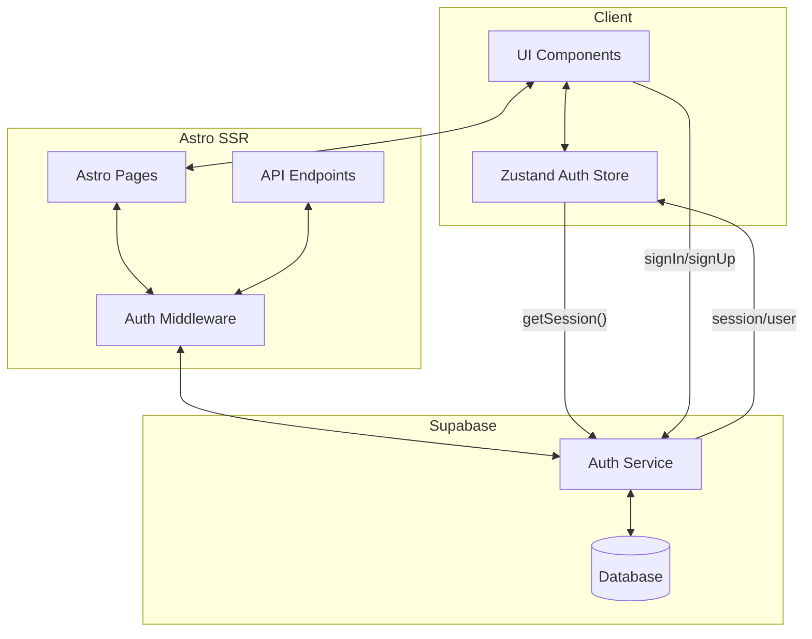
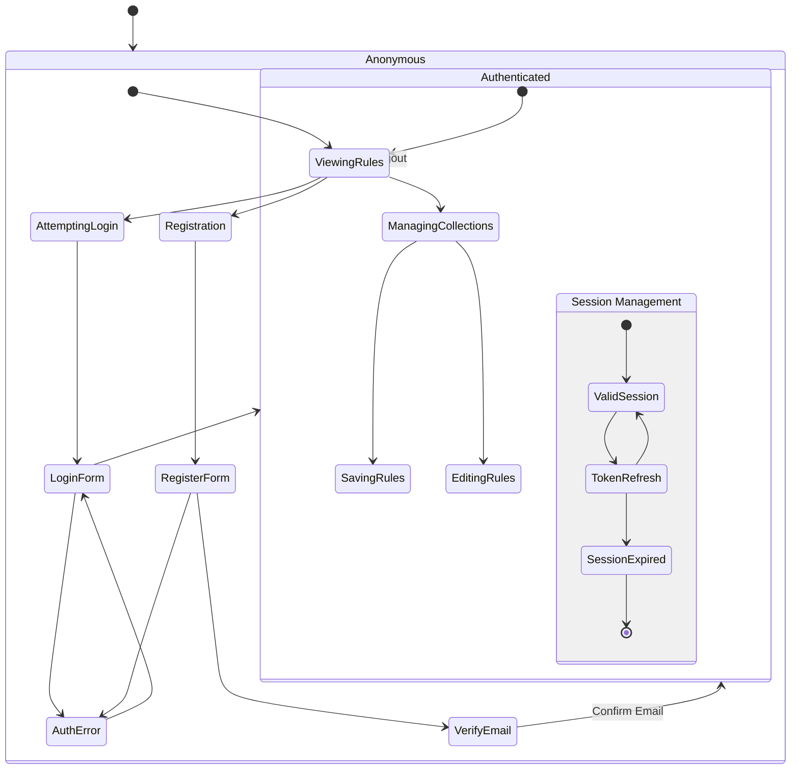

# Diagramy przepływu autentykacji

## 1. Przepływ danych między warstwami aplikacji

## 2. Architektura komponentów UI

```mermaid
flowchart TB
    subgraph "Layout Structure"
        Layout[Layout.astro]
        Topbar[Topbar.tsx]
        AuthNav[AuthNav.tsx]
    end

    subgraph "Auth Pages"
        LoginPage[login.astro]
        RegisterPage[register.astro]
        ResetPage[reset-password.astro]
    end

    subgraph "Auth Components"
        LoginForm[LoginForm.tsx]
        RegisterForm[RegisterForm.tsx]
        ResetForm[ResetForm.tsx]
        AuthStatus[AuthStatus.tsx]
    end

    Layout --> Topbar
    Topbar --> AuthNav
    AuthNav --> AuthStatus

    LoginPage --> LoginForm
    RegisterPage --> RegisterForm
    ResetPage --> ResetForm

    %% Stylowanie
    classDef existing fill:#2d3748,stroke:#4a5568
    class Layout,Topbar existing
```

## 3. User Journeys w kontekście autentykacji

## Objaśnienia do diagramów

### 1. Przepływ danych

- Pokazuje interakcję między klientem (React components + Zustand), warstwą SSR (Astro) i Supabase
- Middleware weryfikuje sesję dla chronionych endpointów
- Store synchronizuje stan autentykacji między komponentami

### 2. Architektura komponentów

- Integruje się z istniejącym `Layout.astro` i `Topbar.tsx`
- Wprowadza nowe komponenty autoryzacyjne
- Zachowuje konwencje Astro (strony) i React (komponenty interaktywne)

### 3. User Journeys

- Obrazuje ścieżki użytkownika: logowanie, rejestracja, zarządzanie sesją
- Uwzględnia obsługę błędów i weryfikację email
- Pokazuje różnice między dostępem anonimowym a autoryzowanym
