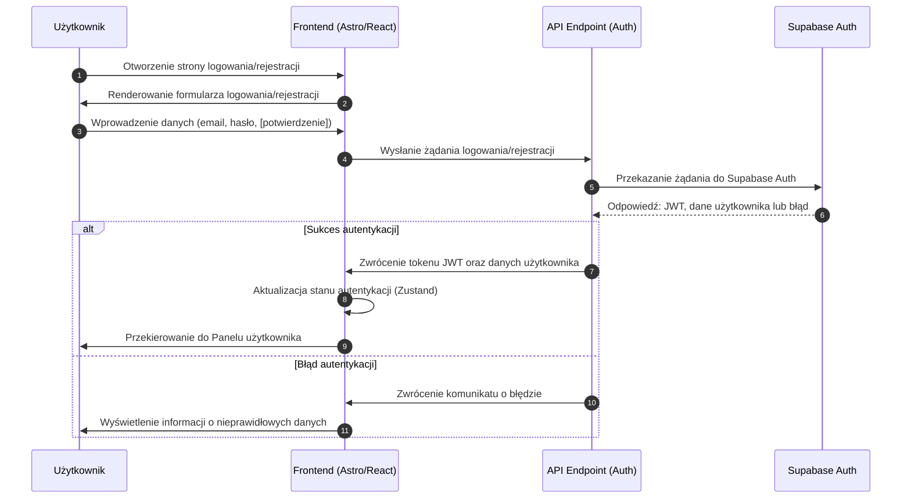

# Mechanizm Autentykacji w 10xRules.ai

Poniższy diagram sekwencji przedstawia szczegółowy mechanizm autentykacji w aplikacji 10xRules.ai. Diagram uwzględnia wymagania opisane w dokumentach [project-prd.md](mdc:.ai/project-prd.md) i [journeys.md](mdc:.ai/diagrams/journeys.md) oraz wykorzystuje technologie zdefiniowane w [tech-stack.md](mdc:.ai/tech-stack.md).

## Opis Mechanizmu

1. **Logowanie/Rejestracja:**

   - Użytkownik otwiera stronę logowania/rejestracji, gdzie Frontend (zbudowany w Astro/React) renderuje formularz.
   - Użytkownik wypełnia formularz, podając wymagane dane (email, hasło oraz w przypadku rejestracji – potwierdzenie hasła).

2. **Żądanie do API:**

   - Po przesłaniu formularza, Frontend wysyła żądanie do dedykowanego API Endpointu (np. `/api/auth`), który zarządza procesem autentykacji.

3. **Interakcja z Supabase:**

   - API przekazuje żądanie do Supabase Auth, korzystając z mechanizmu opartego na JWT, co jest zgodne z wytycznymi z [tech-stack.md](mdc:.ai/tech-stack.md).
   - Supabase przetwarza żądanie, weryfikując dane użytkownika, a następnie zwraca odpowiedź (sukces – JWT token i dane użytkownika, lub błąd).

4. **Obsługa Wyniku:**
   - W przypadku sukcesu, API odsyła token JWT oraz dane użytkownika do Frontendu. Frontend następnie aktualizuje stan aplikacji (przy użyciu Zustand) i przekierowuje użytkownika do Panelu użytkownika.
   - W przypadku błędu, API przekazuje komunikat o błędzie do Frontendu, który wyświetla odpowiednią informację użytkownikowi.

Diagram ten obrazuje pełną ścieżkę autentykacji, integrując interakcje między warstwą frontendową, API oraz usługą Supabase Auth.
