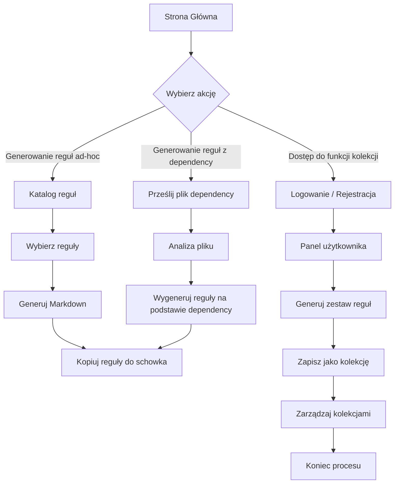

# Scenariusze Użytkownika

Poniżej przedstawiono wszystkie scenariusze użytkownika zgodnie z wymaganiami projektowymi aplikacji 10xRules.ai.

## Diagram Scenariuszy

## Opis Scenariuszy

### 1. Generowanie reguł ad-hoc

- **Proces:**
  1. Użytkownik trafia na **Stronę Główną**.
  2. Wybiera opcję **"Generowanie reguł ad-hoc"**.
  3. Przegląda **Katalog reguł** i wybiera interesujące go elementy.
  4. System generuje zestaw reguł w formacie Markdown.
  5. Użytkownik kopiuje wygenerowane reguły do schowka.

### 2. Generowanie reguł z dependency

- **Proces:**
  1. Użytkownik trafia na **Stronę Główną**.
  2. Wybiera opcję **"Generowanie reguł z dependency"**.
  3. Użytkownik przesyła plik dependency (np. _package.json_ lub _requirements.txt_).
  4. System analizuje przesłany plik i wykrywa zależności.
  5. Na podstawie analizy, system generuje odpowiedni zestaw reguł.
  6. Użytkownik otrzymuje wygenerowany zestaw reguł w formacie Markdown z możliwością skopiowania.

### 3. Zarządzanie kolekcjami (dla zalogowanych użytkowników)

- **Proces:**
  1. Użytkownik trafia na **Stronę Główną**.
  2. Wybiera opcję **"Logowanie / Rejestracja"**.
  3. Po udanej autentykacji użytkownik uzyskuje dostęp do **Panelu użytkownika**.
  4. Użytkownik generuje zestaw reguł, korzystając z metod ad-hoc lub z dependency.
  5. Wygenerowany zestaw reguł zapisuje jako kolekcję, podając nazwę i opis.
  6. Użytkownik zarządza kolekcjami: edytuje, aktualizuje, przywraca poprzednią wersję lub usuwa kolekcję.
