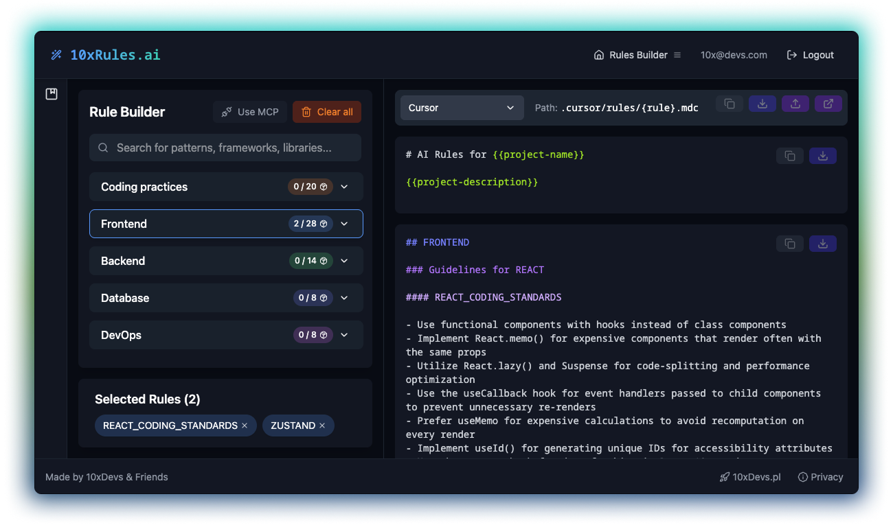

# 10xRules.ai by 10xDevs

<!-- ALL-CONTRIBUTORS-BADGE:START - Do not remove or modify this section -->
[](#contributors-)
<!-- ALL-CONTRIBUTORS-BADGE:END -->

[](https://github.com/przeprogramowani/ai-rules-builder/actions/workflows/deploy-app.yml)



👉 [10xRules.ai](https://10xrules.ai)

Create so called "rules for AI" written in Markdown, used by tools such as GitHub Copilot, Cursor and Windsurf, through an interactive, visual interface.

## Features

- **Build AI Rules:** Create customized rule sets for different editors (Copilot, Cursor, Windsurf)
- **Export Options:** Easily copy to clipboard or download as markdown files
- **Smart Import:** Automatically generate rules by dropping package.json or requirements.txt files
- **Editor Integration:** Provides programmatic access to rules via an [MCP Server](./mcp-server/README.md) for integration with AI assistants in editors like Cursor


## Getting Started

1. **Installation**

   ```bash
   npm install
   ```

2. **Development**

   ```bash
   npm run dev
   ```

3. **Build**
   ```bash
   npm run build
   ```
## Local Supabase Setup

1. Install Supabase CLI

  Check [Supabase docs](https://supabase.com/docs/guides/local-development?queryGroups=package-manager&package-manager=brew#quickstart) for local setup reference.

   ```bash
   brew install supabase/tap/supabase
   ```

2. Start Supabase (requires local Docker)

   ```bash
   supabase start
   ```

3. Verify Supabase is running

 ```bash
  supabase status
  ```


## Dotenv

Create `.env.local` file and add the following variables:

```bash
PUBLIC_ENV_NAME=local
SUPABASE_URL=http://localhost:54321
SUPABASE_PUBLIC_KEY=your_supabase_anon_key
SUPABASE_SERVICE_ROLE_KEY=your_supabase_service_role_key

CF_CAPTCHA_SITE_KEY=1x00000000000000000000AA
CF_CAPTCHA_SECRET_KEY=1x0000000000000000000000000000000AA
```

## Tech Stack

- Astro 5
- TypeScript 5
- React 18.3
- Tailwind 4
- Zustand
- Lucide React

## Project Components

This repository contains multiple key components:

-   **AI Rules Builder UI (Root):** The main Astro/React application providing the web interface for creating and managing AI rules.
-   **MCP Server (`./mcp-server`):** A Cloudflare Worker implementing the Model Context Protocol (MCP). This server allows AI assistants (like Cursor, Claude, etc.) to programmatically access the defined AI rules via specific tools (`listAvailableRules`, `getRuleContent`). This enables integration with editors for fetching context-aware coding guidelines. For detailed setup, usage, and planned features, see the [MCP Server README](./mcp-server/README.md).

### Feature Flags

The project uses a feature flags system to separate deployments from releases. Feature flags can be used to control functionality availability based on the environment (`local`, `integration`, `prod`). The system supports flags for:

- API endpoints
- Astro pages
- UI components visibility

For detailed documentation about feature flags implementation, see `.ai/feature-flags.md`.

### Testing

This project uses a comprehensive testing stack including unit tests and end-to-end tests.

### Unit Testing with Vitest

Unit tests are implemented using Vitest with JSDOM for browser environment simulation and React Testing Library for component testing.

Available commands:

```bash
# Run unit tests
npm run test

# Run tests in watch mode
npm run test:watch

# Run tests with UI
npm run test:ui

# Generate coverage report
npm run test:coverage
```

### End-to-End Testing with Playwright

E2E tests are implemented using Playwright with the Page Object Model pattern for maintainable tests.

Available commands:

```bash
# Run E2E tests
npm run test:e2e

# Run E2E tests with UI
npm run test:e2e:ui

# Generate test code with codegen
npm run test:e2e:codegen
```

### Test Structure

- `tests/unit/` - Unit tests
- `tests/setup/` - Test setup files
- `e2e/` - End-to-end tests
- `e2e/page-objects/` - Page Object Model classes
- `e2e/fixtures/` - Test fixtures and data

### CI/CD Integration

Tests are automatically run in the CI/CD pipeline using GitHub Actions. See `.github/workflows/tests.yml` for configuration.

## Contributions

Send updates to:

- `src/data/dictionaries.ts`
- `src/data/rules/...`

Important: Introduce translations for new rules in `src/i18n/translations.ts`, otherwise the unit test will fail.

## How to Write Effective Rules

When contributing new rules, please:

- **Be specific:** "Use React.memo for expensive components" not "Optimize components"
- **Make it actionable:** Provide clear guidance that can be immediately applied
- **Include placeholders:** Use `{{placeholder_text}}` for project-specific values
- **Follow conventions:** Match the style and structure of existing rules
- **Focus on best practices:** Rules should represent industry standards, not personal preferences

See examples in `src/data/rules/` directory for each technology stack.

---

[10xDevs](https://10xdevs.pl) - launching soon 🚀

## Contributors ✨

Thanks goes to these wonderful people ([emoji key](https://allcontributors.org/docs/en/emoji-key)):

<!-- ALL-CONTRIBUTORS-LIST:START - Do not remove or modify this section -->
<!-- prettier-ignore-start -->
<!-- markdownlint-disable -->
<table>
  <tbody>
    <tr>
      <td align="center" valign="top" width="14.28%"><a href="https://github.com/damianidczak"><br /><sub><b>Damian</b></sub></a><br /><a href="https://github.com/przeprogramowani/ai-rules-builder/commits?author=damianidczak" title="Code">💻</a></td>
      <td align="center" valign="top" width="14.28%"><a href="https://github.com/pawel-twardziak"><br /><sub><b>pawel-twardziak</b></sub></a><br /><a href="https://github.com/przeprogramowani/ai-rules-builder/commits?author=pawel-twardziak" title="Code">💻</a></td>
      <td align="center" valign="top" width="14.28%"><a href="https://github.com/dudziakm"><br /><sub><b>Michal Dudziak</b></sub></a><br /><a href="#maintenance-dudziakm" title="Maintenance">🚧</a></td>
      <td align="center" valign="top" width="14.28%"><a href="https://www.linkedin.com/in/artur-laskowski94"><br /><sub><b>Artur Laskowski</b></sub></a><br /><a href="https://github.com/przeprogramowani/ai-rules-builder/commits?author=arturlaskowski" title="Code">💻</a></td>
      <td align="center" valign="top" width="14.28%"><a href="https://github.com/Michaelzag"><br /><sub><b>Michaelzag</b></sub></a><br /><a href="https://github.com/przeprogramowani/ai-rules-builder/commits?author=Michaelzag" title="Code">💻</a></td>
      <td align="center" valign="top" width="14.28%"><a href="https://github.com/PeterPorzuczek"><br /><sub><b>Piotr Porzuczek</b></sub></a><br /><a href="https://github.com/przeprogramowani/ai-rules-builder/commits?author=PeterPorzuczek" title="Code">💻</a></td>
      <td align="center" valign="top" width="14.28%"><a href="https://michalczukm.xyz"><br /><sub><b>Michał Michalczuk</b></sub></a><br /><a href="https://github.com/przeprogramowani/ai-rules-builder/commits?author=michalczukm" title="Code">💻</a></td>
    </tr>
    <tr>
      <td align="center" valign="top" width="14.28%"><a href="https://www.pawelgnat.com/"><br /><sub><b>Paweł Gnat</b></sub></a><br /><a href="https://github.com/przeprogramowani/ai-rules-builder/commits?author=Pawel-Gnat" title="Code">💻</a></td>
      <td align="center" valign="top" width="14.28%"><a href="https://github.com/kacperklosowski"><br /><sub><b>Kacper Kłosowski</b></sub></a><br /><a href="https://github.com/przeprogramowani/ai-rules-builder/commits?author=kacperklosowski" title="Code">💻</a></td>
    </tr>
  </tbody>
</table>

<!-- markdownlint-restore -->
<!-- prettier-ignore-end -->

<!-- ALL-CONTRIBUTORS-LIST:END -->

We're recognizing all contributors with [all-contributors](https://github.com/all-contributors/all-contributors). Feel invited to collaborate!
